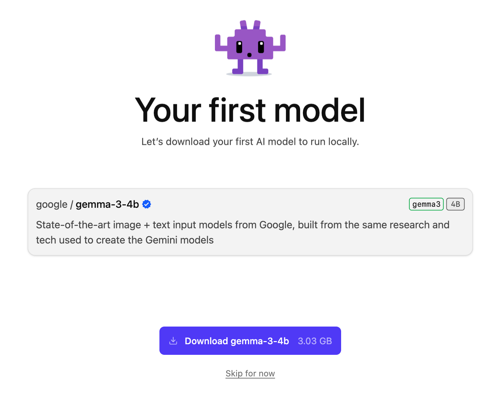
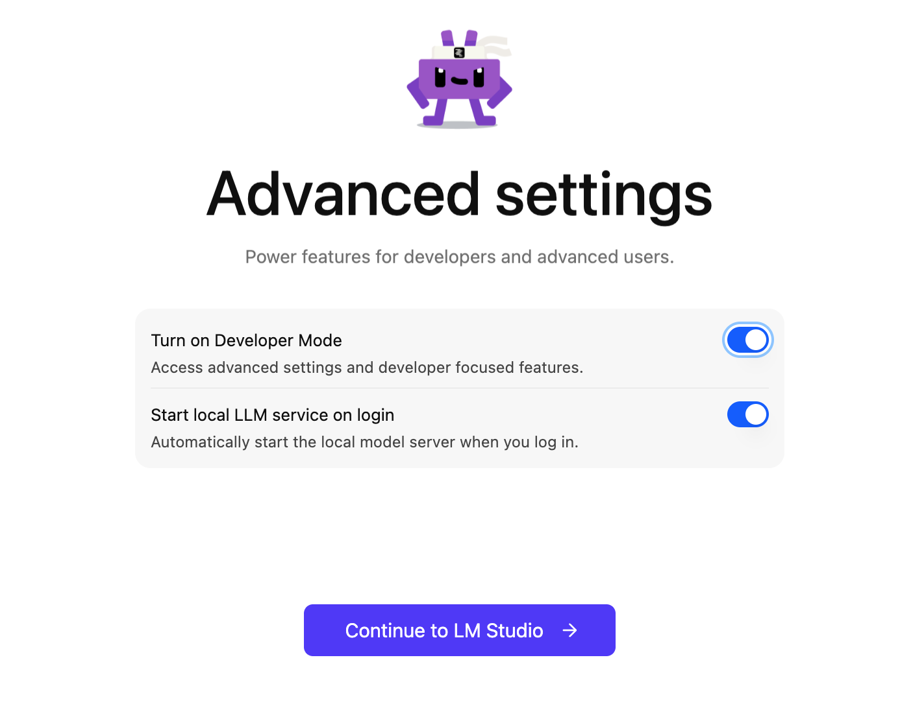

# Installing LM Studio on macOS

## Quick Start

1. **Download** the macOS installer from [lmstudio.ai](https://lmstudio.ai/)
2. Open the downloaded `.dmg` file and move LM Studio to your Applications folder
3. Launch LM Studio from Applications
4. On first launch, LM Studio offers to automatically download **google/gemma-3-4b** (3.03 GB)

5. Enable **Developer Mode** and **Start local LLM service on login**, then click **Continue to LM Studio**

For detailed installation steps, see the [official documentation](https://lmstudio.ai/docs).

## Load a Model

1. Open LM Studio and go to the **Discover** tab
2. Search for `gemma` and download a model variant

## Resources

- [Official download page](https://lmstudio.ai/)
- [LM Studio documentation](https://lmstudio.ai/docs)
